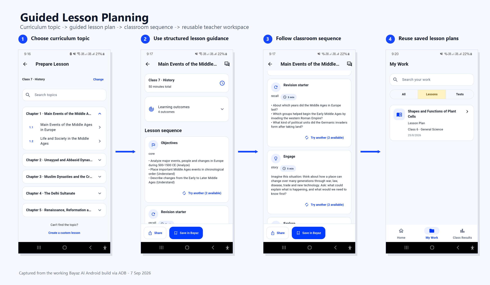
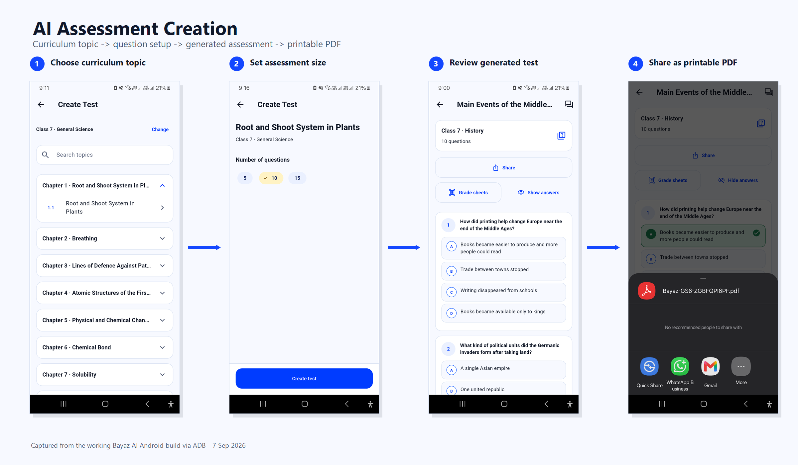
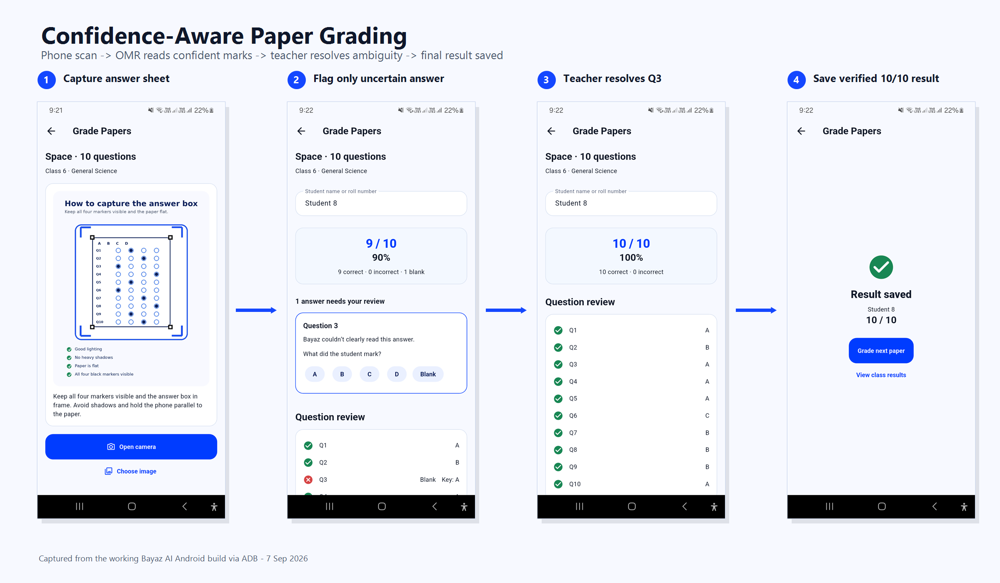
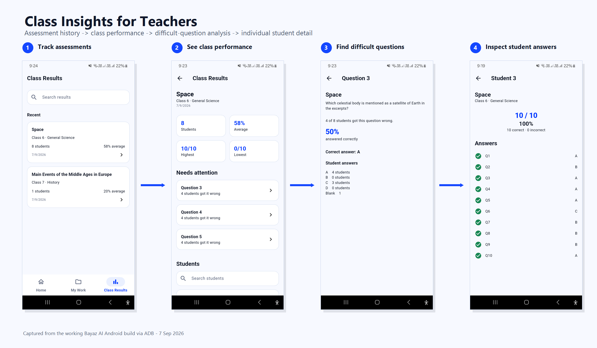

<div align="center">
  

# Bayaz AI

### Offline AI for teachers

**Bayaz AI is an Android app for teachers. Once its AI resources are downloaded, its AI workflows run on-device without an internet connection.**

Bayaz brings guided lesson planning, AI-assisted assessment creation, printable paper tests, phone-based OMR grading, teacher review, and class results into one local teacher workflow.

[Workflow](#workflow) · [Architecture](#architecture) · [Build from source](#build-from-source) · [Prebuilt APKs](#prebuilt-apks) · [Repository layout](#repository-layout)
</div>

## What Bayaz does

Bayaz is built around teachers who want useful automation without requiring every student to use a device.

- Guided lesson planning from configured curriculum and classroom context.
- AI-assisted MCQ assessment creation using relevant curriculum context.
- Printable PDF tests and Bayaz answer sheets.
- Phone-based OMR grading with alignment, rectification, bubble analysis, and confidence checks.
- Teacher review when a marked answer cannot be read confidently.
- Local storage for lessons, tests, graded papers, and class results.
- Question-level class insight and individual student result views.
- Optional local AI for custom lessons, custom tests, and contextual Ask Bayaz assistance.

## Workflow

### Guided lesson planning

Teachers choose the relevant class, subject, and curriculum topic, then work through structured lesson guidance that can be saved and reused.



### Assessment creation

Bayaz can generate MCQ assessments from the selected curriculum context. Teachers choose the assessment size, review the questions, and export the result as a printable PDF.



### Paper grading

A completed Bayaz answer sheet can be captured from an Android phone. The OMR pipeline aligns the image, reads the marked bubbles, and compares them with the saved answer key. If a mark is ambiguous, that answer is sent back to the teacher before the result is saved.



### Class results

Saved grades feed into class summaries, difficult-question views, answer distributions, and per-student result screens.



## Architecture


The application is intentionally local. Curriculum databases, saved teacher work, OMR processing, and results live on the device. The optional AI resources are downloaded separately because the model files are too large to keep in the source repository.

### Main technical components

| Area | Implementation |
|---|---|
| Mobile app | Flutter 3.44.4 and Dart 3.12.2 |
| On-device AI | `llama_cpp_dart` v0.2.0 with a pinned `llama.cpp` runtime |
| Curriculum and content | Packaged SQLite databases and local content assets |
| Retrieval | Local curriculum retrieval used to prepare relevant context |
| PDF output | Dart `pdf` and `printing` packages |
| OMR | Custom image preprocessing, registration, rectification, bubble analysis, confidence checks, and grading |
| Local persistence | Saved lessons, tests, gradebook data, teaching context, and results stored on-device |
| Android target | `arm64-v8a` for the current native runtime |

## Offline operation

Bayaz does not require a cloud inference backend for its local AI workflows. After the AI resources have been downloaded to the phone, the model runtime works on-device.

The current offline design separates a few concerns:

- Curriculum and verified content are packaged with the application.
- Teacher work and grading results are stored locally.
- OMR processing runs locally on the phone.
- Model files are downloaded separately and remain on the device until the teacher removes them.
- Custom lesson generation, custom assessment generation, and Ask Bayaz can use the downloaded local model resources.
- Guided lesson planning remains a structured curriculum workflow and should not be read as automatic AI lesson-plan generation.

This keeps the app usable in classrooms where connectivity is limited after the initial setup.

## Repository layout

| Path | Purpose |
|---|---|
| `app/` | Flutter Android application and packaged runtime assets. |
| `pipeline/` | Curriculum processing, generation, validation, and database packaging. |
| `prompts/` | Versioned prompt sources used by local generation workflows. |
| `eval/` | Retrieval and generation evaluation utilities. |
| `scripts/` | Toolchain setup, native runtime setup, validation, and build support. |
| `docs/` | Architecture decisions, setup notes, validation material, and screenshots. |
| `research/` | Exploratory work that is not part of the current runnable product. |
| `site/` | Static Bayaz product website deployed through GitHub Pages. |

## Build from source

### Toolchain

The repository currently pins the following Android build environment:

| Component | Version |
|---|---:|
| Flutter | 3.44.4 |
| Dart | 3.12.2 |
| Android Gradle Plugin | 8.11.1 |
| Gradle | 9.1.0 |
| Kotlin | 2.3.20 |
| Java | 17 |
| Android SDK platform | 36 |
| Android Build Tools | 35.0.0 |
| Android NDK | 28.2.13676358 |
| Native Android API floor | 24 |
| Current ABI | arm64-v8a |

The detailed toolchain notes are in [`docs/setup/TOOLCHAIN.md`](docs/setup/TOOLCHAIN.md).

### 1. Bootstrap the Android toolchain

On Linux x86_64, the repository can install its pinned Flutter and Android command-line tools under `~/.local/share/bayaz-toolchain`:

```bash
bash scripts/bootstrap-toolchain.sh
```

If you already have the required versions installed, you can use your existing environment instead.

### 2. Restore the local AI runtime

From the repository root:

```bash
bash scripts/setup-llama.sh
bash scripts/check-environment.sh
```

`setup-llama.sh` restores the pinned `llama_cpp_dart` checkout and its `llama.cpp` dependency under the ignored `third_party/` directory, then builds the Android arm64 native libraries used by the app.

### 3. Resolve Flutter packages

```bash
cd app
flutter pub get
```

### 4. Validate the checkout

From the repository root:

```bash
python scripts/validation/validate_repository.py

cd app
flutter analyze
flutter test
```

The Python validator checks repository structure and packaged resources. It does not replace Flutter analysis, tests, Android builds, model inference tests, or physical-camera OMR testing.

### 5. Run on Android

Enable Android developer options and USB debugging, connect an Android device, then run:

```bash
cd app
flutter devices
flutter run
```

The current native setup targets `arm64-v8a` Android devices.

## Build an APK

### Debug APK

A debug build does not require production signing:

```bash
cd app
flutter build apk --debug
```

Flutter writes the APK under `app/build/app/outputs/flutter-apk/`.

### Release APK

Release builds require a signing identity. Copy the repository template and fill it locally:

```bash
cd app
cp android/key.properties.example android/key.properties
flutter build apk --release
```

You can also configure signing through environment variables:

```text
BAYAZ_KEYSTORE_PATH
BAYAZ_KEYSTORE_PASSWORD
BAYAZ_KEY_ALIAS
BAYAZ_KEY_PASSWORD
```

Keep keystores, passwords, certificates, and private signing keys outside Git. Android updates must continue to use the same production signing identity.

More Android run and signing notes are available in [`RUN_ON_ANDROID.md`](RUN_ON_ANDROID.md).

## Prebuilt APKs

Prebuilt APKs are not published yet. We plan to upload verified APK builds once we have time to package and smoke-test the distributable releases properly.

Until then, Bayaz can be built directly from source using the steps above.

## OMR notes

Bayaz uses its own answer-sheet layout and alignment markers. The grading pipeline includes image preprocessing, template checks, registration, rectification, bubble measurement, and confidence-aware review.

The repository also contains deterministic OMR smoke-test material used during development. Those fixtures are useful for repeatable pipeline validation, but they are not a substitute for broader physical-camera testing across different phones, printers, lighting conditions, paper quality, and handwriting styles.

## Current status

Bayaz AI is an active prototype and hackathon build focused on the teacher-facing Android workflow. The current repository does not implement a production school-administration backend, billing system, cloud analytics platform, or account infrastructure.

A few practical limitations are worth knowing:

- The optional AI model weights are not committed to Git and must be downloaded separately.
- The native Android runtime currently targets `arm64-v8a`.
- Release builds require your own signing configuration.
- OMR validation is still being expanded beyond the deterministic smoke fixtures.
- The public website is static and lives under `site/`.

## Code contributors

The Git history includes substantial code contributions from **Muhammad Musaab Ul Haq** and **Zayn**. The wider Bayaz team also contributes to product work, testing, outreach, presentations, and hackathon delivery.

<div align="center">
  <strong>Built for teachers.</strong>
</div>