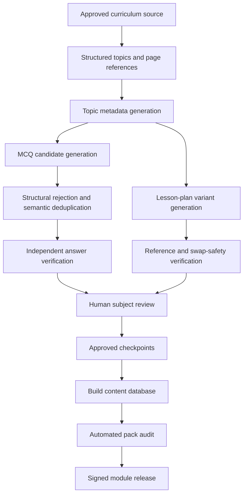

# Curriculum content quality and release gate

## Scope

This document defines the minimum process for shipping a Bayaz curriculum module. It covers generated MCQs, answer keys, rationales, lesson-plan variants, module metadata, and the runtime safeguards used when a teacher creates a paper.

## Current pack status

The bundled Class 6 General Science database is structurally valid, but it is not suitable for an unqualified production release without a fresh content build and human review. The generated audit in `CURRENT_PACK_AUDIT.md` records the current evidence:

- one topic has only five verified questions;
- source answer positions are heavily concentrated in B and C;
- normalized duplicate stems occur across overlapping topics;
- several chapter/section numbers map to multiple topic records; and
- some lesson-plan variants expose internal excerpt references or depend on figures/tables that are not embedded in the plan.

The application mitigates paper-level answer-position bias and never silently recycles saved questions. It cannot prove the educational correctness of existing generated prose. The source checkpoints and approved source textbooks required to rebuild the pack are not present in this archive, so regeneration remains an external content blocker.

## Required generation pipeline



A generation run must never write directly into the database shipped by the app. Each stage writes immutable/versioned checkpoints. The pack builder consumes only completed and approved checkpoints.

## Automated MCQ checks

Every candidate must pass all of the following before independent answer verification:

1. Non-empty stem and four non-empty, distinct options.
2. Exactly one answer key in A–D.
3. No `all of the above`, `none of the above`, label-dependent answer, negative stem, or prompt scaffolding.
4. Stem length and reading level appropriate for the class.
5. Semantic deduplication within the topic.
6. No answer rationale that contradicts the selected option.
7. Difficulty and Bloom label within the supported taxonomy.

Independent verification should answer the question from the approved curriculum context without seeing the generator's answer first. A mismatch is rejected or held for human adjudication; it is never included as a verified item.

## Answer-position policy

The source bank should be approximately balanced across A, B, C, and D over every sufficiently large topic and over the module as a whole. The pack audit reports the distribution and the reviewer must investigate any position below 15% or above 35% unless the bank is very small.

At runtime, Bayaz creates balanced target positions for each paper and moves the correct option while shuffling distractors. It does not reorder a question whose text depends on position, labels, `above`, or named option letters. Such questions should normally have been rejected by the generation pipeline.

## Repeat-question policy

The application records source item IDs in saved papers. It uses all unseen verified questions before considering a previously used item. When the unused bank cannot fill the requested paper, the teacher receives a confirmation dialog showing the number of repeats. Cancellation leaves the library unchanged. Reuse metadata is persisted with the paper.

A topic with fewer than ten total verified questions produces an honestly labelled shorter paper. The application does not invent questions or imply that a ten-question bank exists.

## Lesson-plan verification

Each topic requires at least one safe variant for every required section. A variant is excluded when it contains:

- prompt-internal excerpt or passage references;
- unavailable numbered figure or table references;
- cross-variant language such as “as above” or “same apparatus”;
- a materials entry that is actually a textbook citation; or
- instructions that cannot be followed with the listed materials.

The material-citation detector uses word boundaries. It must not mistake ordinary terms such as “protein-rich”, “catch”, “pinch”, or “switch” for a `Ch 4` citation.

`build_content_db` now loads the `plan_verify` checkpoint, excludes flagged variants individually, and refuses to ship a topic when any required section has no safe remaining variant.

## Human review protocol

A qualified subject teacher must review the release candidate. At minimum:

- verify every answer key for thin banks and a statistically meaningful sample elsewhere;
- review all items flagged by automated checks;
- inspect every lesson-plan variant for safety, feasibility, age appropriateness, local availability of materials, and curriculum alignment;
- confirm that diagrams or source references are either included or unnecessary;
- inspect Urdu/English language quality where applicable;
- confirm that no generated text presents stereotypes, unsafe experiments, medical claims, or high-cost requirements;
- record reviewer identity, date, source edition, outcome, and required corrections.

A content module is approved only when all release blockers are resolved and the review record is attached to the module version.

## Release commands

From the repository root:

```bash
cd pipeline
uv run python -m src.build_content_db
uv run python -m src.audit_content_pack \
  --markdown ../docs/content/CURRENT_PACK_AUDIT.md \
  --json ../docs/content/current_pack_audit.json
```

The audit must exit successfully. The resulting database hash, module version, source-edition identifier, review record, and minimum compatible app version must then be published in the production resource manifest.

## Rollback

Never overwrite an approved module artifact in place. Publish a new semantic version. Retain at least the previous known-good module and its manifest. A withdrawn module version must remain identifiable so devices can reject or roll back it without confusing locally saved papers whose item IDs came from the earlier version.
